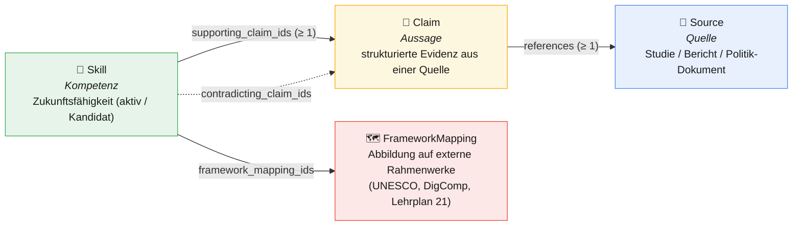
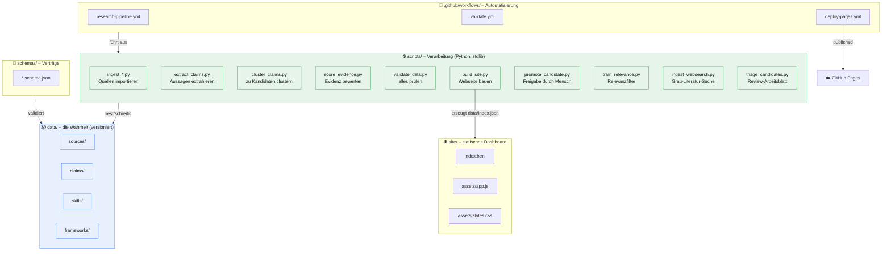
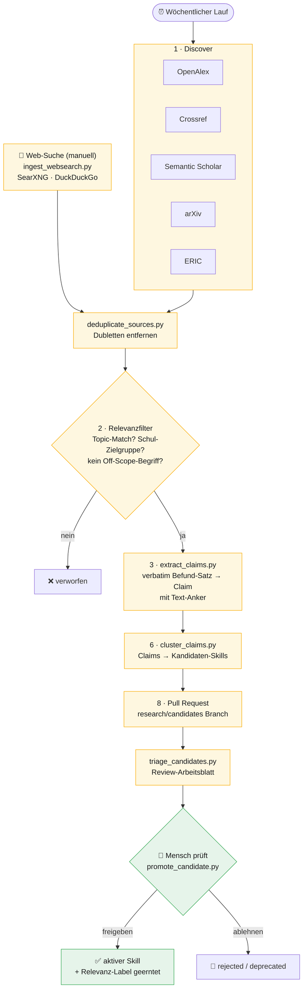
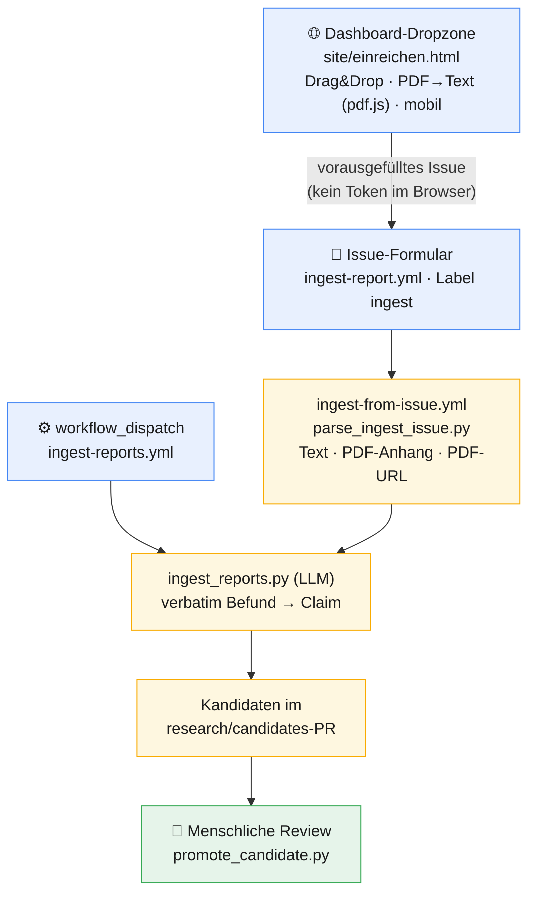
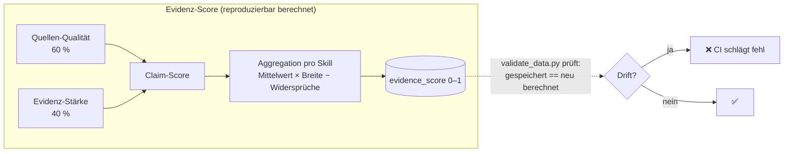
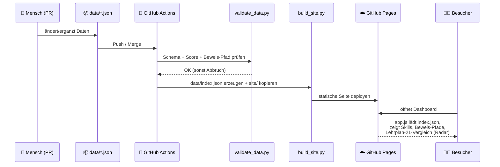

# Architektur des Future Skills Evidence Graph

*Eine verständliche Erklärung der Lösung – mit Diagrammen.*

Dieses Dokument erklärt, **wie** die Anwendung aufgebaut ist und **wie die Teile
zusammenspielen**. Die fachliche Idee „keine Kompetenz ohne Beweis-Pfad" wird in
[erklaerung-fuer-laien.md](erklaerung-fuer-laien.md) ohne Technik beschrieben –
hier geht es um die technische Architektur.

---

## 1. Das Grundprinzip in einem Satz

> Ein **versioniertes, statisches Daten-Repository** (kein Server, keine
> Datenbank) bildet einen Wissensgraphen aus *Quellen → Aussagen → Kompetenzen →
> Frameworks*. Skripte befüllen, prüfen und veröffentlichen diesen Graphen;
> Menschen geben über Pull Requests frei.

Die ganze Lösung ist bewusst **datei-basiert**: Alle Inhalte liegen als JSON in
`data/`, werden durch JSON-Schemas validiert und durch Python-Skripte
verarbeitet. Es gibt keine laufende Server-Komponente – die „Anwendung" ist ein
Build-Schritt, der eine statische Webseite erzeugt.

---

## 2. Das Datenmodell (der Graph)

Das Herz der Lösung sind vier Datentypen, die wie eine Beweiskette
zusammenhängen. Jeder Pfeil ist eine erzwungene Referenz.



**Die eisernen Regeln (von `validate_data.py` erzwungen):**

- Jede **aktive** Kompetenz braucht ≥ 1 stützende Aussage.
- Jede Aussage braucht ≥ 1 Quelle samt exaktem Text-Anker.
- Unfertige Einträge bleiben sichtbar als `candidate` markiert.

Die Schemas dazu liegen in `schemas/` (`source.schema.json`, `claim.schema.json`,
`skill.schema.json`, `framework_mapping.schema.json`).

---

## 3. Die Komponenten-Landkarte

So sind die Verzeichnisse und ihre Rollen verteilt:



Nur `validate.yml` läuft verpflichtend bei jedem Push. Der Wochenlauf
(`research-pipeline.yml`) wird durch **manuell ausgelöste** Workflows ergänzt:
`ingest-websearch.yml` (Grau-Literatur-Suche), `ingest-from-issue.yml` und
`ingest-reports.yml` (Bericht-Import), `resolve-url-check.yml`
(URL-Auflösungs-Diagnose) und `eval-prefill-record.yml` (LLM-Prefill-Baseline).

---

## 4. Die Forschungs-Pipeline (Maschine schlägt vor)

Der wöchentliche Workflow füllt den Graphen mit **Kandidaten**. Wichtig: jeder
Schritt ist bewusst konservativ und nichts wird automatisch „aktiv".



**Der Relevanzfilter** (Schritt 2) ist das wichtigste Präzisions-Werkzeug:

- Standard: ein **transparenter Keyword-/Topic-Heuristik-Filter** (deterministisch,
  ohne Abhängigkeiten, immer der Fallback).
- Zusätzliche Tore: **Off-Scope-Begriffe** (z. B. Ernährung, Gehalt) und ein
  **Zielgruppen-Tor** (nur Alter 0–18, keine reinen Hochschul-/Workforce-Paper).
- Optional und **abschaltbar**: ein trainiertes TF-IDF-+-Logistic-Regression-Modell
  (`models/relevance_model.json`) sowie Embedding-Prototyp-Anker
  (`models/relevance_anchors.json`, real-semantisch via sentence-transformers
  `all-MiniLM-L6-v2`, fixture-gestützt offline). Beide sind aktuell **deaktiviert**,
  weil sie die Heuristik im fairen Vergleich (`eval_relevance.py --compare-model`
  bzw. `--compare-embedding`) *nicht* schlagen – die Heuristik führt auf dem
  Label-Set mit F1 0.92 (Modell 0.86, Embedding `st` 0.76).

### 4a · Manueller Eingang (Mensch reicht selbst ein)

Neben dem wöchentlichen Lauf kann ein Mensch einen Bericht (OECD / WEF / UNESCO
o. ä.) **jederzeit selbst einreichen** – per Drag & Drop im Dashboard, über ein
Issue-Formular oder per Workflow-Dispatch. Alle drei Wege münden in **denselben
Kandidaten-PR und dieselben Guard Rails** wie die Pipeline; nichts wird
automatisch aktiv.



Der **Verbatim-Guard** gilt auch hier: jede vom LLM vorgeschlagene Aussage muss
ein wörtliches Zitat des Berichtstexts sein, sonst wird sie verworfen. Die
Dashboard-Seite hält bewusst **kein Secret** – sie liest die Datei lokal und
öffnet nur ein vorausgefülltes Issue, das der Mensch bestätigt; die Anmeldung
übernimmt GitHub. Eine reine PDF-URL wird erst serverseitig (im Workflow)
gelesen. Details: [report-import.md](report-import.md).

### 4b · Web-Suche (graue Literatur, manuell)

Neben den fünf Katalog-APIs gibt es eine **nur manuell ausgelöste** Discovery-Lane
für graue Literatur: `scripts/ingest_websearch.py` (Workflow `ingest-websearch.yml`,
nur `workflow_dispatch`) stellt eine Topic-Suchanfrage an offene Backends
(SearXNG, keyless DuckDuckGo, optional Google) und legt Treffer als
Kandidaten-Quellen an – genau jene, die die schlüssellosen Kataloge nie zeigen.
Die Strategie ist **offene Suche, gestufter Trust** (`data/source_domains.json`):
jede Fundstelle bekommt eine Trust-Stufe (`trusted`/`watch`/`open`), aber die
Stufe ist nur ein **Label** für die Triage-Reihenfolge – sie ist kein Filter und
fließt **nicht** in den `evidence_score`. Web-Treffer bleiben
`source_type: web_resource` (niedrigstes Gewicht) und minten **keine** Claims;
diese entstehen weiterhin verbatim über `extract_claims.py` /
`ingest_reports.py`. `scripts/audit_domains.py` (`make audit-domains`) leitet aus
den Review-Entscheidungen evidenzbasiert ab, welche Domains eine Trust-Stufe
verdienen (siehe [allowlist-pflegen.md](allowlist-pflegen.md)).

---

## 5. Das Vertrauens-Prinzip: Mensch + reproduzierbare Bewertung

Zwei Dinge sorgen dafür, dass dem Katalog vertraut werden kann:



Der `evidence_score` wird **nie von Hand gesetzt** – `score_evidence.py` berechnet
ihn, und `validate_data.py` lässt den Build fehlschlagen, sobald ein gespeicherter
Wert von der Formel abweicht. So bleibt das Vertrauenssignal des Dashboards immer
reproduzierbar.

Die **menschliche Freigabe** (`promote_candidate.py`) ist das zweite Prinzip: Sie
verweigert die Freigabe, solange maschinelle Platzhalter übrig sind, erzwingt,
dass aktive Skills nur auf geprüften Claims ruhen, berechnet die Scores neu und
re-validiert – und schreibt nichts, falls eine Prüfung fehlschlägt.

Damit der Mensch den offenen Kandidaten-Rückstand überblickt, bündelt
`scripts/triage_candidates.py` alle offenen Kandidaten zu einem geordneten
Review-Arbeitsblatt (verbatim-Aussage, Topics, Quelle(n), optionale
LLM-`assist`-Vorschläge) samt den exakten `promote_candidate.py`-Befehlen. Es
schreibt nichts nach `data/` und promotet nichts – es ist reine Lesehilfe vor der
menschlichen Entscheidung.

---

## 6. Vom Daten-Commit zur Webseite (Veröffentlichung)



Das Dashboard ist rein statisch: `app.js` liest die einzige generierte Datei
`data/index.json` und rendert daraus alle Ansichten – inkl. des Lehrplan-21-
Vergleichs mit Radar-Chart, Zyklus-Filter, Abdeckungstabelle und Lücken-Labels.

---

## 7. Warum diese Architektur? (Die Leitentscheidungen)

| Entscheidung | Begründung |
| --- | --- |
| **Datei-basiert, kein Server/DB** | Versionierbar, diff-bar, prüfbar über Git; nichts läuft dauerhaft, nichts kann „still" driften. |
| **JSON-Schemas als Verträge** | Datenqualität wird maschinell erzwungen, nicht per Konvention erhofft. |
| **Nur Standardbibliothek im Import-/Inferenzpfad** | Importer bleiben dependency-frei und robust; scikit-learn nur als Dev-/CI-Abhängigkeit fürs *Training*. |
| **Mensch-in-der-Schleife über Pull Requests** | Automatik erzeugt nur Kandidaten; Veröffentlichung ist immer eine bewusste menschliche Entscheidung. |
| **Reproduzierbare Scores statt Handnoten** | Niemand kann eine Lieblingskompetenz „hochstufen"; das Vertrauenssignal ist nachrechenbar. |
| **Heuristik als Default, Modell optional** | Transparenz und Auditierbarkeit vor Black-Box; das Modell wird nur aktiv, wenn es messbar besser ist. |
| **Graceful Degradation der Importer** | Fällt eine Quelle aus, laufen die anderen weiter – der wöchentliche Lauf bricht nicht ab. |
| **Offene Web-Suche, gestufter Trust (Label statt Filter)** | Graue Literatur wird gefunden (guter Recall), aber Domain-Vertrauen ordnet nur die Triage-Reihenfolge – es verzerrt nie den reproduzierbaren `evidence_score`. |

---

## 8. Gesamtbild auf einen Blick

```mermaid
graph TB
    EXT["🌍 Externe Quellen-APIs<br/>OpenAlex · Crossref · S2 · arXiv · ERIC"]
    WEBSRC["🔎 Web-Suche (manuell)<br/>graue Literatur"]
    EXT --> PIPE
    WEBSRC --> PIPE

    subgraph AUTO["🤖 Automatisierung (schlägt vor)"]
        PIPE["Import → Filter → Extraktion → Clustering"] --> CAND["Kandidaten im PR"]
        CAND --> TRIAGE["🗂️ Triage-Arbeitsblatt<br/>(triage_candidates.py)"]
    end

    TRIAGE --> HUMAN["👤 Menschliche Review<br/>(promote_candidate.py)"]

    subgraph GRAPH["📦 Evidenz-Graph (versioniert in data/)"]
        SRC2[Sources] --> CLM2[Claims] --> SKL2[Skills] --> FWK2[Frameworks]
    end

    HUMAN -->|"freigegeben"| GRAPH
    GRAPH --> VALID["✅ validate_data.py<br/>(Schema · Score · Beweis-Pfad)"]
    VALID --> BUILD2["build_site.py → index.json"]
    BUILD2 --> DASH["🌐 Statisches Dashboard<br/>GitHub Pages"]

    classDef ext fill:#f1f3f4,stroke:#5f6368,color:#1a1a1a;
    classDef auto fill:#fef7e0,stroke:#f9ab00,color:#1a1a1a;
    classDef graph fill:#e8f0fe,stroke:#4285f4,color:#1a1a1a;
    classDef human fill:#e6f4ea,stroke:#34a853,color:#1a1a1a;
    class EXT,WEBSRC ext;
    class PIPE,CAND,TRIAGE auto;
    class SRC2,CLM2,SKL2,FWK2 graph;
    class HUMAN,VALID human;
```

---

*Verwandte Dokumente:* [README.md](../README.md) ·
[OPERATIONS.md](../OPERATIONS.md) (Runbook) ·
[erklaerung-fuer-laien.md](erklaerung-fuer-laien.md) (ohne Technik) ·
[report-import.md](report-import.md) (manueller Bericht-Import) ·
[lehrplan21-coverage-methodik.md](lehrplan21-coverage-methodik.md).
