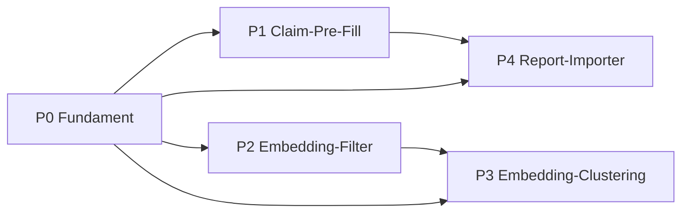

# Umsetzungsplan: KI-Weiterentwicklung des Evidence Graph

*Schritt-für-Schritt-Plan in eigenständig lieferbaren Paketen – mit Tests und
fertigen Umsetzungs-Prompts.*

Dieses Dokument beschreibt, **wie** die in der Architektur-Diskussion
identifizierten KI-Verbesserungen konkret und risikoarm umgesetzt werden. Es
baut auf der bestehenden Lösung auf (siehe [architektur.md](architektur.md)) und
hält strikt deren Leitprinzipien ein.

---

## 0. Leitplanken (nicht verhandelbar)

Jedes Paket muss diese Regeln einhalten – sie sind die Bedingung dafür, dass KI
das Projekt verbessert statt sein Vertrauenssignal zu beschädigen:

1. **KI nur im Vorschlags-/Kandidatenpfad.** Niemals im Score-Pfad
   (`score_evidence.py`), in der Validierung (`validate_data.py`) oder in der
   finalen Freigabe (`promote_candidate.py` setzt `active`). KI erzeugt
   ausschließlich `candidate`-Daten.
2. **Opt-in & abschaltbar.** Jede KI-Funktion sitzt hinter einem Env-Flag und
   hat die deterministische Heuristik als **Fallback** – exakt wie das heutige
   `RELEVANCE_CLASSIFIER`-Muster in `common.py::decide_relevance`.
3. **Determinismus in CI.** Tests und CI laufen **netzwerkfrei** gegen
   gecachte Fixtures. Live-LLM-/Embedding-Aufrufe nur in einem manuell
   ausgelösten Workflow, nie im Pflicht-CI. `temperature=0` für reproduzierbare
   LLM-Ausgaben.
4. **Messen vor Aktivieren.** Keine KI-Komponente wird scharf geschaltet, bevor
   sie auf einem Label-Set **messbar** besser ist als der Status quo – nach dem
   Vorbild von `eval_relevance.py --compare-model`.
5. **Provenienz & Erklärbarkeit.** Jede maschinelle Ausgabe trägt Provenienz
   (Modell-ID, Prompt-Version, Zeitstempel) und lässt die erklärbare
   Keyword-Spur (`topics`) unangetastet.
6. **Graceful Degradation.** Netz-/API-Ausfälle dürfen den Wochenlauf nicht
   abbrechen – analog `common.py::fetch_or_warn`. Bei Fehler: Warnung + Fallback.
7. **Wörtliche Beweise bleiben wörtlich.** `statement` und `text_anchor` bleiben
   verbatim aus dem Abstract. KI ergänzt nur die heute manuellen Felder als
   *Vorschlag* – sie überschreibt keine Beweise und keine Anker.

---

## 1. Paket-Übersicht

| # | Paket | Nutzen | Risiko | Abhängig von |
| - | --- | --- | --- | --- |
| **P0** | Fundament: Provider-Abstraktion, Flags, Provenienz, Fixtures | hoch (Enabler) | niedrig | – |
| **P1** | LLM-Claim-Pre-Fill (Kontext/Outcome/Alter/Stärke als Vorschlag) | **sehr hoch** | mittel | P0 |
| **P2** | Embedding-Relevanzfilter als Zusatzsignal | hoch | mittel | P0 |
| **P3** | Embedding-basiertes Claim-Clustering | mittel | mittel | P0, P2 |
| **P4** | LLM-Kandidaten aus API-losen Quellen (OECD/WEF/UNESCO) | mittel | höher | P0, P1 |

Empfohlene Reihenfolge: **P0 → P1 → P2 → P3 → P4**. P1 und P2 sind nach P0
unabhängig und können parallel laufen.

Jedes Paket ist ein eigener Pull Request mit dem immer gleichen Lebenszyklus:
**Design → Schema/Flag → Implementierung → Offline-Unit-Tests → Eval-Gate →
Doku → Draft-PR → Review**.

---

## 2. Querschnitt: Teststrategie & Reproduzierbarkeit

Diese Bausteine gelten für alle Pakete und werden in P0 angelegt:

- **Fixture-Cache statt Live-Calls.** Ein `tests/fixtures/`-Verzeichnis hält
  aufgezeichnete LLM-/Embedding-Antworten (`request_hash -> response`). Der
  Provider liest im Test- und CI-Modus nur aus dem Cache; ein Cache-Miss in CI
  ist ein Testfehler, kein Netzaufruf.
- **Golden-Sets für die Bewertung.** Neue Label-Dateien unter `eval/`
  (`claim_prefill_labeled.json`, `relevance_embedding_labeled.json`), analog zu
  `eval/relevance_labeled.json`.
- **Mess-Skripte** je Fähigkeit, analog `eval_relevance.py`, die
  Precision/Recall/F1 bzw. Feld-Übereinstimmung berichten und als CI-Gate
  dienen (`--min-*`-Flags).
- **Sklearn-/Provider-gated Tests.** Wie schon `--compare-model`: Tests, die ein
  optionales Paket brauchen, werden übersprungen statt zu scheitern, wenn die
  Dependency fehlt.
- **Schema-Tests.** `tests/test_data_integrity.py` wird je Paket erweitert: alle
  KI-erzeugten Datensätze müssen weiterhin `status == "candidate"` sein und das
  JSON-Schema erfüllen.

---

## 3. Die Pakete im Detail

### P0 — Fundament: Provider-Abstraktion & Leitplanken

**Ziel.** Eine einheitliche, abschaltbare KI-Schnittstelle, auf der P1–P4
aufsetzen, ohne die Importer dependency-schwer zu machen.

**Umfang.**
- Neues Modul `scripts/ai_provider.py` mit **zwei getrennten** Interfaces, weil
  Text-Generierung und Embeddings von verschiedenen Anbietern kommen:
  `complete(prompt, *, schema=None) -> dict` (LLM) und
  `embed(texts) -> list[vector]` (Embeddings).
- **LLM-Provider** per Env-Flag mit Fallback: `AI_PROVIDER` ∈
  `none` (Default) | `anthropic` | `cache`. `none` → jede KI-Fähigkeit gibt
  „kein Vorschlag" zurück, exakt wie heute. SDK: offizielles `anthropic`-Paket.
- Default-LLM: aktuelles Claude-Modell (`claude-opus-4-8`); konfigurierbar
  über `AI_MODEL`. API-Key aus `ANTHROPIC_API_KEY`. Strukturierte Ausgaben über
  `output_config.format` (JSON-Schema) — **kein** Assistant-Prefill (auf Opus 4.8
  mit 400 abgelehnt) und **kein** `temperature` (ebenfalls entfernt); Determinismus
  über `output_config.effort` + striktes Schema.
- **Embedding-Provider** ist davon getrennt (`EMBEDDING_PROVIDER`), denn Anthropic
  hat **keine** native Embeddings-API. Empfohlen: ein lokales, dependency-armes
  Modell (z. B. `sentence-transformers`) — wahrt Netzunabhängigkeit und
  Reproduzierbarkeit; Alternative wäre ein externer Dienst wie Voyage AI. Wird
  erst von P2/P3 benötigt.
- Fixture-Cache-Layer (Abschnitt 2) + `fetch_or_warn`-Stil-Wrapper für Graceful
  Degradation.
- Provenienz-Helfer `ai_provenance(model, prompt_version)`.
- Schema-Erweiterung: optionales Feld `assist` (Objekt) in `claim.schema.json`
  und `source.schema.json`, das **nur** Vorschläge + Provenienz trägt und nie
  von Validierung/Score gelesen wird.

**Tests / Akzeptanz.**
- `AI_PROVIDER=none` ⇒ Pipeline verhält sich byte-identisch zu heute
  (Regressionstest gegen bestehende Erwartungswerte).
- Cache-Provider liefert deterministisch aus Fixture; Cache-Miss in CI schlägt
  fehl.
- Schema akzeptiert Datensätze mit und ohne `assist`; `assist` ist nie
  Pflichtfeld.
- `requirements-dev.txt` dokumentiert `anthropic` als reine Dev-/Live-Dependency
  (Importpfad bleibt stdlib bei `none`/`cache`).

#### Umsetzungs-Prompt P0

```
Kontext: Repo future-skills-evidence-graph. Lies docs/architektur.md, README.md
(Abschnitt "Optional trained relevance classifier") und scripts/common.py
(decide_relevance, fetch_or_warn, RELEVANCE_CLASSIFIER-Muster).

Aufgabe: Lege das Fundament für optionale, abschaltbare KI-Funktionen an, ohne
den bestehenden Standard zu verändern.

1. Erstelle scripts/ai_provider.py mit:
   - Env-Flags AI_PROVIDER (none|anthropic|cache, Default none), AI_MODEL
     (Default claude-opus-4-8), ANTHROPIC_API_KEY; sowie EMBEDDING_PROVIDER
     (none|local|... , Default none) fuer den GETRENNTEN Embedding-Pfad.
   - complete(prompt, *, schema=None) -> dict: nutzt das offizielle anthropic-SDK
     mit output_config.format (JSON-Schema). KEIN temperature und KEIN Assistant-
     Prefill (beide auf Opus 4.8 mit 400 abgelehnt); Determinismus ueber
     output_config.effort='low'. Bei stop_reason=='refusal' -> None.
   - embed(texts) -> list[list[float]]: eigener Anbieter (Anthropic hat KEINE
     Embeddings-API). Default 'none' -> None; 'local' nutzt ein lokales Modell.
   - Einem Fixture-Cache (tests/fixtures/ai/), der Requests per stabilem Hash
     auf gespeicherte Antworten abbildet; im Modus 'cache' nur lesen.
   - Graceful Degradation im fetch_or_warn-Stil: bei Fehler Warnung auf stderr +
     leeres/None-Ergebnis, nie Exception nach oben.
   - ai_provenance(prompt_version) -> dict mit model, prompt_version, created_at.
2. Erweitere schemas/claim.schema.json und schemas/source.schema.json um ein
   OPTIONALES Objektfeld "assist" (suggestions + provenance). Es darf nie
   Pflicht sein und wird von validate_data.py/score_evidence.py NICHT gelesen.
3. Ergänze requirements-dev.txt: 'anthropic' als reine Dev-/Live-Dependency mit
   Kommentar, dass der Importpfad bei AI_PROVIDER in {none,cache} stdlib bleibt.
4. Tests in tests/test_data_integrity.py:
   - AI_PROVIDER=none erzeugt identisches Verhalten wie bisher.
   - Cache-Provider ist deterministisch; Cache-Miss in CI ist ein Fehler.
   - Schema akzeptiert Records mit und ohne "assist".

Constraints: Default-Verhalten unverändert. Keine neue Pflicht-Dependency im
Importpfad. Alles netzwerkfrei testbar. Führe `python -m unittest discover -s
tests` und `python scripts/validate_data.py` aus, bis grün.
```

---

### P1 — LLM-Claim-Pre-Fill *(größter Hebel)*

**Ziel.** Die heute rein manuellen Felder eines Kandidaten-Claims – `context`,
`outcome`, `age_range`, vorgeschlagene `evidence_strength` – als **LLM-Vorschlag**
ins Review bringen, um den Aufwand pro Claim drastisch zu senken. `statement`
und `text_anchor` bleiben unverändert deterministisch.

**Umfang.**
- `extract_claims.py` ruft bei aktivem Provider zusätzlich
  `suggest_claim_fields(abstract, statement, topics)` auf und schreibt das
  Ergebnis **nur** nach `claim["assist"]["suggestions"]` – die echten Felder
  behalten ihre Platzhalter (`AGE_RANGE_PLACEHOLDER` etc.).
- `promote_candidate.py` zeigt die Vorschläge an und kann sie per Flag
  (`--accept-suggestions`) als Startwerte übernehmen; der Mensch bestätigt jeden
  Wert (der Platzhalter-Gate-Mechanismus bleibt scharf).
- In-Feature-Prompt versioniert (siehe Anhang A); Ausgabe als striktes JSON über
  `output_config.format`. **Kein** `temperature` (auf Opus 4.8 entfernt → 400);
  niedrige Streuung über `output_config.effort='low'` plus das strikte Schema.

**Tests / Akzeptanz.**
- Golden-Set `eval/claim_prefill_labeled.json`: Abstracts mit von Hand
  kuratierten Soll-Feldern. Neues `scripts/eval_claim_prefill.py` misst
  Feld-Übereinstimmung (z. B. Alters-Range-Treffer, Outcome-ROUGE/Embedding-Sim,
  Strength-Exact-Match) und dient als `--min-*`-Gate.
- Ohne Provider (`none`): `claim["assist"]` fehlt, Verhalten = heute.
- Promotion verweigert weiterhin, solange Platzhalter in den **echten** Feldern
  stehen – Vorschläge allein aktivieren nichts.
- CI nutzt nur Fixtures.

#### Umsetzungs-Prompt P1

```
Kontext: Baut auf P0 (scripts/ai_provider.py, Feld "assist"). Lies
scripts/extract_claims.py (claim_from_source, Platzhalter-Konstanten) und
scripts/promote_candidate.py (claim_review_errors).

Aufgabe: LLM-gestütztes Pre-Fill der manuellen Claim-Felder als VORSCHLAG.

1. Neue Funktion suggest_claim_fields(abstract, statement, topics) ->
   {age_range, outcome, context, evidence_strength} | None, die ai_provider.complete
   mit dem versionierten Prompt aus docs/ki-weiterentwicklung-plan.md Anhang A
   aufruft (output_config.format mit JSON-Schema, effort='low', KEIN temperature).
   Bei Provider 'none', stop_reason=='refusal' oder Fehler: None.
2. In claim_from_source: wenn ein Vorschlag vorliegt, schreibe ihn nach
   claim["assist"] = {"suggestions": ..., "provenance": ai_provenance(...)}.
   Die ECHTEN Felder behalten ihre Platzhalter. statement/text_anchor unverändert.
3. In promote_candidate.py: Vorschläge anzeigen; optionales Flag
   --accept-suggestions übernimmt sie als Startwerte, ändert aber NICHT das
   Review-Gate (Platzhalter in echten Feldern => weiterhin keine Promotion).
4. eval/claim_prefill_labeled.json (>= 20 Beispiele) + scripts/eval_claim_prefill.py
   mit Precision-artigen Feldmetriken und --min-* CI-Gate.
5. Tests: 'none' = altes Verhalten; Vorschlag landet nur unter "assist";
   Promotion-Gate bleibt scharf; alles aus Fixtures.

Constraints: Keine Änderung an statement/text_anchor/Scores. Lauf
`python -m unittest discover -s tests`, `python scripts/validate_data.py`,
`python scripts/eval_claim_prefill.py` bis grün.
```

---

### P2 — Embedding-Relevanzfilter als Zusatzsignal

**Ziel.** Die harten Restfälle des Keyword-Filters (Lehrer-Tool-Nutzung,
Katastrophen-/Gesundheits-Paper mit Schul-Wort – siehe README/OPERATIONS) über
**semantische Ähnlichkeit** zu kuratierten In-Scope-Ankern besser trennen.

**Umfang.**
- Neuer Modus `RELEVANCE_CLASSIFIER=embedding` in `common.py::decide_relevance`
  (dritte Option neben `heuristic`/`model`), mit Heuristik als Fallback.
- Embeddings über `ai_provider.embed` (separater `EMBEDDING_PROVIDER`, **nicht**
  Anthropic — siehe P0; empfohlen: lokales Modell für Offline-/Reproduzierbarkeit).
- Kuratierte Anker-Embeddings (positive/negative Prototypen) als versioniertes
  Artefakt `models/relevance_anchors.json`; Score = Ähnlichkeit zu Positiv- minus
  Negativ-Prototypen.
- `topics` bleibt in **jedem** Modus die erklärbare Keyword-Begleitspur.

**Tests / Akzeptanz.**
- `eval_relevance.py` bekommt einen Embedding-Pfad analog `--compare-model`:
  fairer Vergleich Heuristik vs. Embedding auf `eval/relevance_labeled.json`
  (+ harvested, optional). **Aktivierung nur, wenn Embedding F1 messbar
  schlägt.**
- Regressionstest `test_relevance_heuristic_meets_measured_floor` bleibt
  unverändert in Kraft (Heuristik bleibt Default-Schutz).
- Offline: Embeddings der Eval-Beispiele als Fixture gecacht.

#### Umsetzungs-Prompt P2

```
Kontext: Baut auf P0. Lies scripts/common.py (decide_relevance,
relevance_classifier_mode, heuristic_keep) und scripts/eval_relevance.py
(compare_with_model).

Aufgabe: Embedding-Relevanz als optionales Zusatzsignal, Heuristik bleibt Default.

1. Erweitere decide_relevance um den Modus 'embedding': lade
   models/relevance_anchors.json (positive/negative Prototyp-Embeddings),
   berechne Cosine-Sim-Differenz, entscheide gegen eine Schwelle aus dem
   Artefakt. Fehlt das Artefakt oder der Provider => Warnung + heuristic_keep.
   topics weiterhin immer aus dem Vokabular.
2. Skript scripts/build_relevance_anchors.py, das die Anker aus
   eval/relevance_labeled.json via ai_provider.embed erzeugt und versioniert
   ablegt (mit Provenienz: Modell, Datum, Eingabe-Hashes).
3. Erweitere eval_relevance.py um einen fairen Vergleich Heuristik vs. Embedding
   (gleiche Berichtsform wie --compare-model, ehrliches VERDICT).
4. Tests: Embedding-Pfad deterministisch aus Fixtures; bei fehlendem Artefakt
   exakt Heuristik-Verhalten; test_relevance_heuristic_meets_measured_floor
   bleibt grün.

Constraints: Default RELEVANCE_CLASSIFIER=heuristic unverändert. Aktivierung nur
nach messbarem Gewinn. Lauf unittest + `python scripts/eval_relevance.py
--compare-model` (sofern Embedding vorhanden auch der neue Vergleich) bis grün.
```

---

### P3 — Embedding-basiertes Claim-Clustering

**Ziel.** `cluster_claims.py` gruppiert verwandte Claims auch dann, wenn sie
nicht dasselbe Topic-Stichwort teilen, und schlägt so subtilere
Kompetenz-Kandidaten vor.

**Umfang.**
- Optionaler Clustering-Modus (Env-Flag, z. B. `CLUSTER_METHOD=embedding`) mit
  dem bestehenden Vokabular-Clustering als Default/Fallback.
- Claim-Embeddings über `ai_provider.embed` (derselbe separate
  `EMBEDDING_PROVIDER` wie in P2, nicht Anthropic).
- Agglomeratives/Schwellen-Clustering über Claim-Embeddings; jedes erzeugte
  Cluster bleibt `candidate` mit `evidence_score 0.0`.
- Bestehende Skills bekommen weiterhin nur Review-Hinweise, keine
  Auto-Verknüpfung.

**Tests / Akzeptanz.**
- Deterministisches Clustering auf Fixture-Embeddings (fixe Schwelle, stabile
  Sortierung).
- Ausgabe erfüllt `skill.schema.json`, Status immer `candidate`.
- Ohne Provider: identisch zum heutigen Vokabular-Clustering.

#### Umsetzungs-Prompt P3

```
Kontext: Baut auf P0+P2 (ai_provider.embed). Lies scripts/cluster_claims.py
(cluster_candidate_skills).

Aufgabe: Optionales Embedding-Clustering, Vokabular-Clustering bleibt Default.

1. Flag CLUSTER_METHOD (vocabulary|embedding, Default vocabulary). Bei
   'embedding': Claim-Embeddings holen, mit fixer Cosine-Schwelle agglomerativ
   clustern, pro Cluster einen Kandidaten-Skill (status candidate,
   evidence_score 0.0, Provenienz) vorschlagen. Bestehende Skills nur als Hinweis.
2. Deterministische, stabil sortierte Ausgabe (reproduzierbar bei gleichem Input).
3. Tests: Clustering auf Fixture-Embeddings ist deterministisch; Ausgabe erfüllt
   skill.schema.json; 'vocabulary' = heutiges Verhalten.

Constraints: Nichts wird aktiv. Default unverändert. Lauf unittest +
validate_data.py bis grün.
```

---

### P4 — LLM-Kandidaten aus API-losen Quellen (OECD/WEF/UNESCO)

**Ziel.** Die heute manuelle Lücke der Discovery-Phase schließen: aus
OECD-/WEF-/UNESCO-Berichten (kein Such-API) **Kandidaten-Quellen und -Claims**
vorschlagen.

**Umfang.**
- Neuer Importer `scripts/ingest_reports.py`: nimmt lokale/heruntergeladene
  Report-Texte (PDF→Text außerhalb des Importpfads), extrahiert per LLM
  vorgeschlagene Quellen-Metadaten + Befund-Claims, alles `candidate`,
  `evidence_strength` `low`.
- Läuft **nicht** im Pflicht-CI, sondern in einem manuell ausgelösten Workflow;
  Ergebnis geht in denselben Kandidaten-PR-Pfad.
- Strenge Provenienz + Pflicht zur menschlichen Quellenprüfung
  (`promote-source`).

**Tests / Akzeptanz.**
- Fixture-Report → erwartete Kandidaten; alle Ausgaben `candidate`, schemavalide.
- Halluzinationsschutz: jedes vorgeschlagene Zitat muss als wörtliche Passage im
  Quelltext auffindbar sein, sonst verworfen (Anker-Pflicht bleibt).
- Ohne Provider: Importer ist ein No-Op.

#### Umsetzungs-Prompt P4

```
Kontext: Baut auf P0+P1. Lies scripts/ingest_openalex.py (Importer-Muster),
scripts/common.py (filter_relevant_sources, append_candidate_sources) und
scripts/extract_claims.py (Anker-Pflicht).

Aufgabe: LLM-Importer für API-lose Berichtsquellen (OECD/WEF/UNESCO).

1. scripts/ingest_reports.py: Eingang = Report-Plaintext (PDF-Extraktion separat,
   nicht im Importpfad). Per ai_provider.complete vorgeschlagene Source-Metadaten
   + Befund-Claims erzeugen, alle status=candidate, evidence_strength low, mit
   Provenienz. Relevanzfilter (filter_relevant_sources) und Dedupe wie gehabt.
2. Halluzinationsschutz: jedes Claim-statement muss als wörtliche Passage im
   Quelltext vorkommen (sonst verwerfen). text_anchor zitiert diese Passage.
3. Manuell ausgelöster Workflow (.github/workflows/ingest-reports.yml,
   workflow_dispatch), der in den Kandidaten-PR-Pfad schreibt. NICHT im Pflicht-CI.
4. Tests: Fixture-Report -> erwartete Kandidaten; alles candidate & schemavalide;
   erfundene Zitate werden verworfen; Provider 'none' = No-Op.

Constraints: Keine Auto-Aktivierung; menschliche Quellenprüfung bleibt Pflicht.
Lauf unittest + validate_data.py bis grün.
```

---

## 4. Reihenfolge, Abhängigkeiten, Definition of Done



**Definition of Done je Paket:**
- [ ] Default-Verhalten (Provider `none`) byte-identisch zu vorher.
- [ ] Neue Funktion hinter Env-Flag, Heuristik/Status quo als Fallback.
- [ ] Offline-Unit-Tests grün (`python -m unittest discover -s tests`).
- [ ] `python scripts/validate_data.py` grün.
- [ ] Mess-Skript zeigt Gewinn (P1/P2) bzw. Determinismus (P3) – ehrliches
      VERDICT dokumentiert.
- [ ] Doku in README/OPERATIONS ergänzt (Flag, Standard, Trade-off).
- [ ] Draft-PR mit Vorher/Nachher-Messung.

**Aktivierungsregel.** Eine KI-Komponente wird erst nach messbarem Gewinn auf
Default geschaltet – bis dahin shippt sie *deaktiviert* (wie das heutige
TF-IDF-Modell). Bleibt der Gewinn aus, bleibt sie als auditierbare Option liegen.

---

## Anhang A — In-Feature-Prompt für P1 (Claim-Pre-Fill), Version 1

```
System: Du extrahierst strukturierte Evidenz-Metadaten aus dem Abstract einer
bildungswissenschaftlichen Studie. Du erfindest nichts. Wenn der Abstract eine
Angabe nicht hergibt, gib für das Feld null zurück. Antworte ausschließlich als
JSON nach dem vorgegebenen Schema.

User:
Abstract:
"""{abstract}"""

Bereits extrahierter wörtlicher Befund-Satz (NICHT verändern):
"""{statement}"""

Erkannte Topics: {topics}

Liefere Vorschläge für die Review-Felder dieses Claims:
- age_range: Altersbereich der untersuchten Lernenden als "min-max" (6-18-Skala),
  oder null. Studien außerhalb 6-18 => null.
- outcome: 1 Satz, welches Lernergebnis/Effekt berichtet wird (neutral, ohne
  Übertreibung), oder null.
- context: 1 Satz zum Setting (Land, Schulstufe, Interventionsart), oder null.
- evidence_strength: eine von {low, moderate, high}, konservativ geschätzt aus
  Studientyp und Stichprobe; im Zweifel low.

Antwortschema:
{"age_range": string|null, "outcome": string|null, "context": string|null,
 "evidence_strength": "low"|"moderate"|"high"}
```

*Reproduzierbarkeit:* Das Antwortschema wird über `output_config.format`
(JSON-Schema) erzwungen, nicht über Prefill (auf Opus 4.8 mit 400 abgelehnt).
**Kein** `temperature` (ebenfalls entfernt) — niedrige Streuung über
`output_config.effort='low'`. Prompt-Version im `assist.provenance` mitschreiben;
bei `stop_reason=='refusal'` oder Schema-Verstoß den Vorschlag verwerfen
(Fallback = keine Vorschläge).

---

*Verwandte Dokumente:* [architektur.md](architektur.md) ·
[../README.md](../README.md) · [../OPERATIONS.md](../OPERATIONS.md) ·
[erklaerung-fuer-laien.md](erklaerung-fuer-laien.md).
